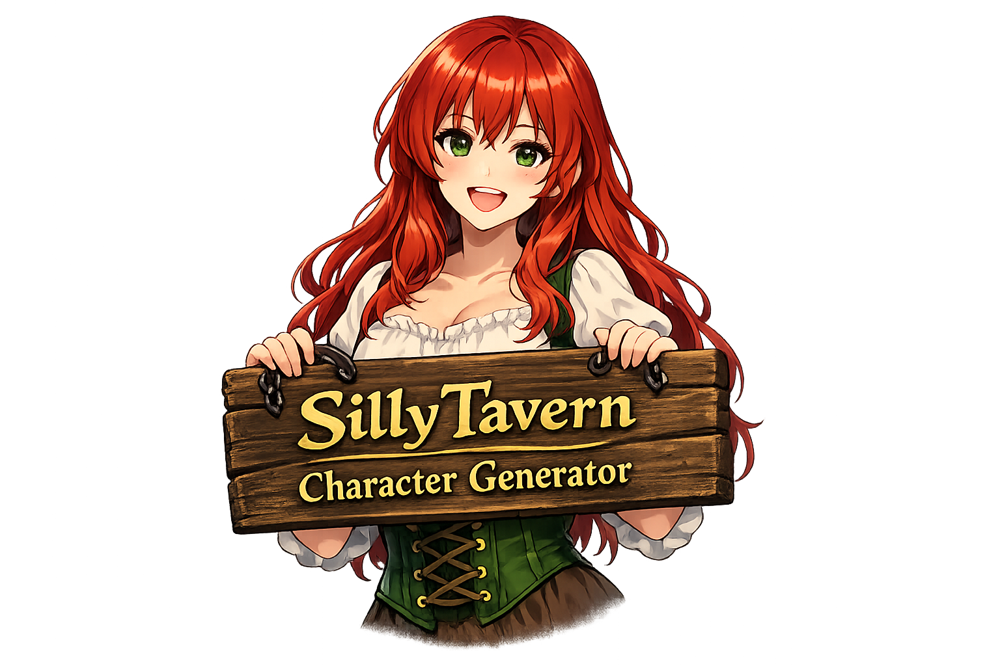
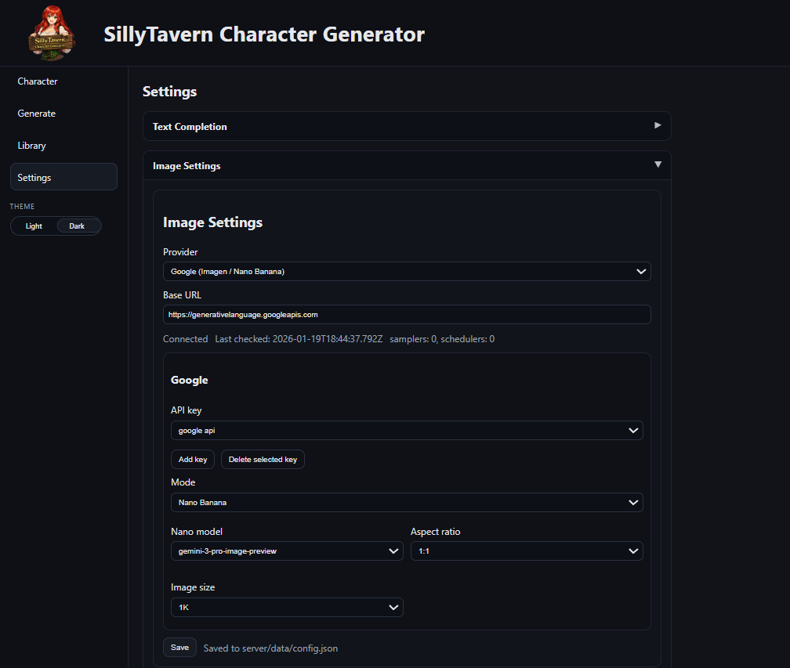
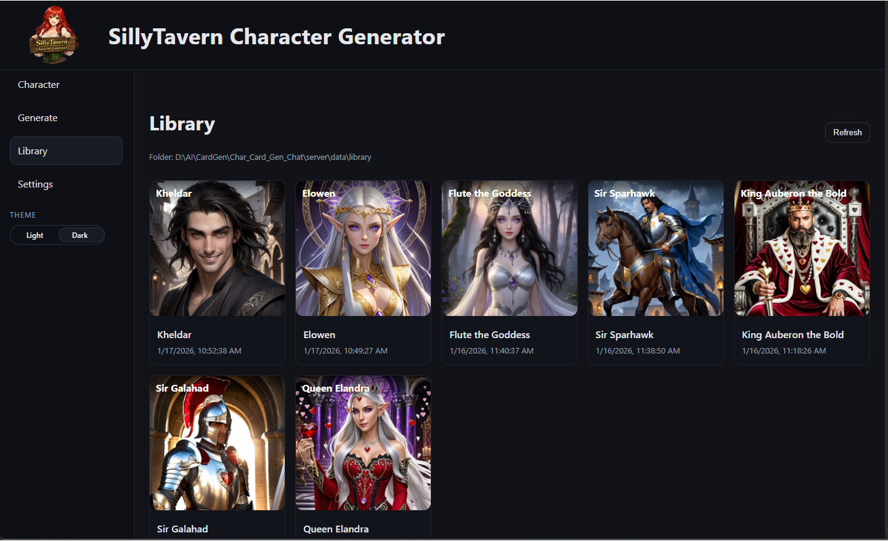

# SillyTavern Character Generator

<p align="center">
  
</p>

A local-first Character Card Generator for **SillyTavern**.  
Create characters from an idea prompt, generate an avatar image, edit fields, and export/import **SillyTavern-compatible JSON + PNG cards**.

This project is a clean build with:
- **Vue 3 + Vite + TypeScript** frontend
- **Node + Express + TypeScript** backend
- A provider system for **Text Completion** + **Image Generation**
- A secure **API key store** (keys are *not* written to config files)

---

## Features

### Character creation
- Generate SillyTavern character fields from a free-text idea prompt
- Optional name + POV selection
- Fill missing fields after import (generate only what’s empty). Enter your thoughts in the Character Idea box to use that while updating.
- Per-field regeneration (regenerate only what you want)

### Image generation
- Generate an avatar image from an image prompt (or create one from fields)
- Multiple image providers (local + hosted)
- View avatar full-size in an overlay

### Import / Export
- Export **character JSON**
- Export **PNG character card** with embedded metadata (SillyTavern-style)
- Export avatar PNG
- Import JSON or PNG cards back into the workspace

### Local character library
- Choose a library folder (persisted) I suggest you point to your Characters folder in SillyTavern! This is the easiest setup.
- Browse cards with thumbnails and click to edit in the workspace.
- Delete from library with confirmation (updates index)

---

## Screenshots

### Character Workspace


### Settings

**Text Completion**


**Image Provider**


### Library



## Provider support

### Text Completion providers
- **KoboldCPP** (local)
- **OpenAI-compatible** (LM Studio / vLLM / OpenRouter-style endpoints)
- **Google Gemini** (OpenAI-compatible endpoint via Gemini API)

### Image providers
- **ComfyUI** (local workflows)
- **Stable Diffusion API (SDAPI)** (local Automatic1111-style endpoint)
- **KoboldCPP** (if enabled for images)
- **Stability AI**
- **Hugging Face Inference Providers**
- **Google**:
  - **Imagen**
  - **Nano Banana** (Gemini image models)

---

## Security & API keys

✅ **API key values are never stored in `config.json` or any file in this repo.**  
Keys are stored securely using **keytar**, which uses your OS credential vault:

- Windows: Credential Manager  
- macOS: Keychain  
- Linux: Secret Service (may require additional setup depending on distro)

The config only stores a **key reference name** (e.g. `apiKeyRef: "my-hf-key"`), not the secret.

---

## Requirements

- **Node.js 20.19+ or 22.12+** (Vite 7 requirement)
- Internet access for hosted providers (Stability/HF/Google)
- Optional local backends:
  - KoboldCPP running (default: `http://127.0.0.1:5001`)
  - ComfyUI running (default: `http://127.0.0.1:8188`)
  

> Note: `keytar` may require build tools on some systems if a prebuilt binary isn’t available.

---

## Quick start (development)

From the repo root:

```bash
npm install
npm run dev
